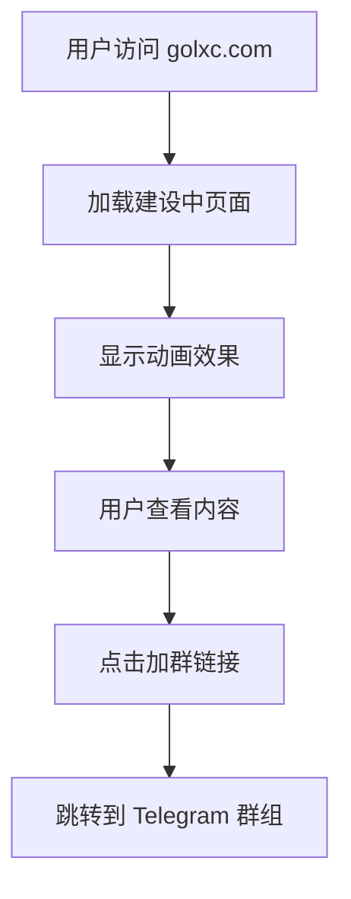

# "网站正在建设中"单页面项目需求文档

## 1. 产品概述
一个优美的"网站正在建设中"HTML单页面，用于临时展示网站状态，包含动画效果和社群引导功能。
- 为网站建设期间提供专业的临时展示页面，告知访客网站正在开发中
- 通过精美的视觉设计和动画效果提升用户体验，维护品牌形象
- 引导用户加入Telegram群组，建立社群连接

## 2. 核心功能

### 2.1 用户角色
本项目无需用户角色区分，所有访客均为匿名用户。

### 2.2 功能模块
项目包含以下核心页面：
1. **主页面**：网站建设中提示、动画效果、社群引导链接

### 2.3 页面详情

| 页面名称 | 模块名称 | 功能描述 |
|----------|----------|----------|
| 主页面 | 标题区域 | 显示"网站正在建设中"主标题，使用优美的字体和动画效果 |
| 主页面 | 副标题区域 | 显示建设进度提示或预计完成时间 |
| 主页面 | 动画效果 | 添加CSS动画，如渐变背景、浮动元素、加载动画等 |
| 主页面 | 社群引导 | 页面底部显示"加入我们的群组"按钮，链接到 t.me/lxcnatserver |
| 主页面 | 响应式布局 | 适配桌面端和移动端显示 |

## 3. 核心流程
用户访问流程：
1. 用户访问网站域名 golxc.com
2. 页面加载并显示建设中提示
3. 用户观看动画效果
4. 用户可选择点击底部链接加入Telegram群组

## 4. 用户界面设计

### 4.1 设计风格
- **主色调**：深蓝色 (#1a1a2e) 和渐变紫色 (#16213e)
- **辅助色**：亮蓝色 (#0f3460) 和白色 (#ffffff)
- **按钮样式**：圆角按钮，悬停时有渐变效果
- **字体**：现代无衬线字体，主标题 2.5rem，副标题 1.2rem
- **布局风格**：居中对齐，卡片式设计
- **动画风格**：平滑的CSS过渡动画，浮动效果，渐变背景

### 4.2 页面设计概览

| 页面名称 | 模块名称 | UI元素 |
|----------|----------|--------|
| 主页面 | 背景区域 | 深色渐变背景，可能包含几何图形或粒子动画效果 |
| 主页面 | 主标题 | 大字号"网站正在建设中"，白色文字，淡入动画 |
| 主页面 | 副标题 | 中等字号说明文字，半透明白色，延迟淡入 |
| 主页面 | 装饰元素 | CSS动画图标或加载动画，旋转或浮动效果 |
| 主页面 | 社群按钮 | 底部固定位置，蓝色渐变按钮，"加入群组"文字 |

### 4.3 响应式设计
桌面优先设计，完全适配移动端，支持触摸交互优化。