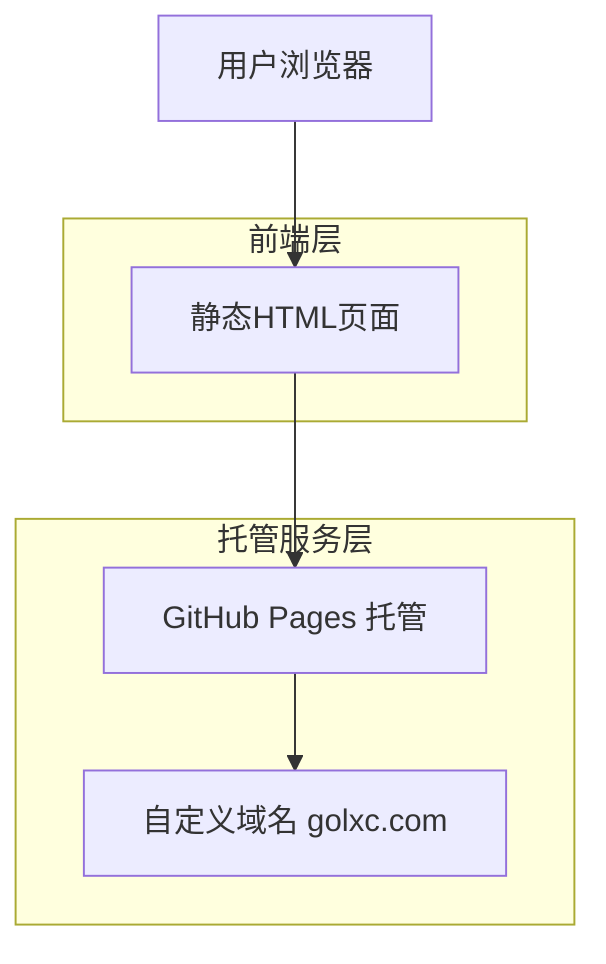

# "网站正在建设中"单页面技术架构文档

## 1. 架构设计



## 2. 技术描述
- 前端：纯HTML + CSS3 + 少量JavaScript（可选）
- 托管：GitHub Pages
- 域名：自定义域名 golxc.com

## 3. 路由定义

| 路由 | 用途 |
|------|------|
| / | 主页面，显示"网站正在建设中"内容 |

## 4. 文件结构

项目文件组织结构：
```
/
├── index.html          # 主页面文件
├── styles.css          # 样式文件（可选，也可内联在HTML中）
├── script.js           # JavaScript文件（可选）
├── README.md           # 项目说明和使用文档
├── CNAME              # GitHub Pages 自定义域名配置
└── assets/            # 静态资源目录（如有图片等）
    └── images/
```

## 5. 核心实现要点

### 5.1 HTML结构
- 使用语义化HTML5标签
- 包含必要的meta标签（viewport、charset等）
- 结构简洁，便于SEO

### 5.2 CSS动画实现
- 使用CSS3 keyframes实现动画效果
- 渐变背景动画
- 文字淡入动画
- 浮动元素动画
- 响应式设计媒体查询

### 5.3 部署配置
- GitHub Pages 自动部署
- CNAME文件配置自定义域名
- 域名DNS配置指向GitHub Pages

## 6. 部署流程

### 6.1 GitHub仓库设置
1. 创建新的GitHub仓库
2. 上传项目文件
3. 启用GitHub Pages功能
4. 配置自定义域名

### 6.2 域名配置
1. 在仓库根目录添加CNAME文件
2. 在域名DNS设置中添加CNAME记录
3. 等待DNS传播完成

### 6.3 SSL证书
GitHub Pages自动提供免费SSL证书支持HTTPS访问。